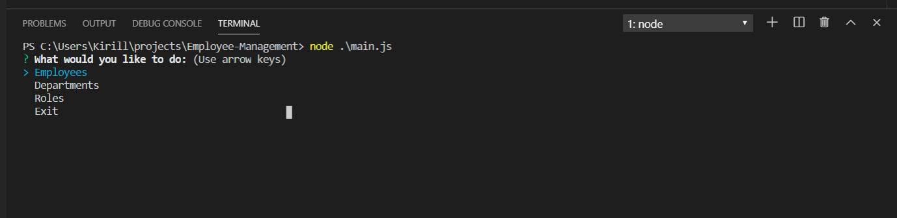
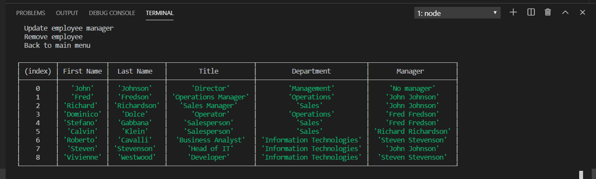

# Employee-Management

Employee Management System

This is a CLI application which is used to manage employees in an organization. It uses Node.js for backend (with inqurer being a library used for CLI interations), and mySQL as a database. 

The application will manage the following:

* Employees
* Roles (titles)
* Departments

The application allows the following operations: 

Employees:
* "View employees by manager", 
* "View, add or remove employees", 
* "Update employee role", and
* "Update employee manager".

Roles:
* "View all roles", 
* "Add role", and
* "Remove role".

Departments: 
* "View all departments", 
* "Departments and budgets", 
* "Add department", and
* "Remove department".

The application will read user input from the CLI menu and display the desired information or perform the desired action.

